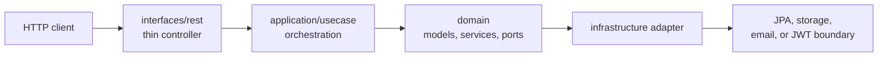
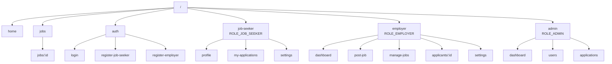

# JobsDB Clone

A full-stack JobsDB-style job marketplace with separate workflows for job seekers, employers, and administrators. The repository is a single monorepo with a Spring Boot API, an Angular web app, shared contract notes, and Docker Compose orchestration for local PostgreSQL, pgAdmin, backend, frontend, and uploaded profile images.

## Repository Map

```text
Fullstack-job-seeker-clone/
|-- backend/                 Spring Boot 4 REST API
|   |-- src/main/java/...     Clean Architecture application code
|   |-- src/main/resources/   application.yml and Flyway migrations
|   |-- src/test/java/...     backend unit and slice tests
|   `-- pom.xml              Maven build
|-- frontend/                Angular 21 web app
|   |-- src/app/             routes, features, data repositories, domain models
|   |-- public/              static public assets
|   |-- nginx.conf           production reverse proxy and SPA routing
|   `-- package.json         npm scripts and dependencies
|-- contracts/               API notes, examples, and future generated clients
|-- docker-compose.yml       production-like local stack
|-- docker-compose.dev.yml   hot-reload development overrides
|-- .env.example             safe local environment template
|-- AGENTS.md                repository guidance for coding agents
`-- README.md
```

Keep framework files inside their owning app folder. The root is reserved for orchestration, shared documentation, and repo-level configuration.

## Backend Structure

Package root: `com.darklordempeor.jobsdb`

```text
backend/src/main/java/com/darklordempeor/jobsdb/
|-- JobsdbApplication.java
|-- domain/
|   |-- model/               pure domain models and enums
|   |-- repository/          repository ports
|   |-- service/             domain services
|   `-- exception/           domain exceptions
|-- application/
|   |-- port/                application-facing external ports
|   `-- usecase/             auth, admin, employer, and job-seeker orchestration
|-- infrastructure/
|   |-- persistence/
|   |   |-- entity/          JPA entities
|   |   |-- repository/      Spring Data JPA repositories
|   |   `-- adapter/         domain repository adapters
|   |-- security/            stateless JWT, Spring Security, Swagger config
|   |-- storage/             local profile-image storage and upload resources
|   `-- email/               SMTP email adapter
`-- interfaces/
    |-- rest/                thin REST controllers
    |-- dto/                 request and response DTOs
    |-- mapper/              MapStruct mappers
    `-- advice/              global exception handling
```

Runtime resources:

```text
backend/src/main/resources/
|-- application.yml          local and docker profile configuration
`-- db/migration/
    |-- V1__init_schema.sql
    |-- V2__seed_admin.sql
    |-- V3__reset_seed_admin_password.sql
    `-- V4__profile_fields_certifications_and_seed_jobs.sql
```

Backend request flow:



Controllers stay thin, domain models stay Spring-free, JPA entities stay separate from domain models, and schema changes are owned by Flyway. API responses use the shared `ApiResponse<T>` envelope.

## Frontend Structure

```text
frontend/src/app/
|-- app.routes.ts            top-level lazy route configuration
|-- app.config.ts            app providers and HTTP interceptor setup
|-- core/
|   |-- auth/                auth service, SignalStore, and role guard
|   |-- http/                functional JWT and error interceptors
|   |-- i18n/                language service
|   `-- layout/              shell, navbar, sidebar, and footer
|-- data/                    API repositories
|-- domain/                  TypeScript interfaces and API models
|-- features/
|   |-- home/                public landing/search entry
|   |-- auth/                login and registration
|   |-- jobs/                public job list, filters, and details
|   |-- job-seeker/          profile, avatar upload, applications, settings
|   |-- employer/            dashboard, post/manage jobs, applicants, settings
|   `-- admin/               dashboard, users, bans, application moderation
`-- shared/
    |-- pipes/               display formatting pipes
    `-- ui/                  reusable standalone UI components
```

Frontend route schematic:



Angular code uses standalone components, lazy feature routes, NgRx SignalStore, functional HTTP interceptors, strict TypeScript, and Tailwind CSS 4. Data access belongs in `frontend/src/app/data/`; shared TypeScript shapes belong in `frontend/src/app/domain/`.

## Features

### Public And Authentication

- Browse active jobs with pagination and keyword or location filtering.
- View public job detail pages.
- Register as a job seeker or employer.
- Log in with stateless JWT authentication and refresh tokens.

### Job Seeker

- Edit profile details including personal information, location, summary, expected salary, resume URL, skills, work experience, education, languages, and licences or certifications.
- Upload a JPG or PNG profile image up to 5 MB. The backend crops and resizes it to a `256 x 256` PNG.
- Apply for jobs and review submitted applications.
- Open settings. The current settings screen updates local UI state only and does not persist to the backend yet.

### Employer

- Edit company profile settings.
- Create, update, publish, close, and review owned jobs.
- Open an applicant list for a job. The current backend endpoint returns an empty placeholder list.

### Admin

- Review dashboard statistics.
- List users, ban users with a reason, and lift bans.
- Review and delete job applications with an audit reason.
- Close jobs.

## Technology

### Backend

- Java 21
- Maven wrapper
- Spring Boot 4.0.6 and Spring Security 7
- Stateless JWT authentication with JJWT 0.12.6
- Spring Data JPA, Hibernate, PostgreSQL 17, and Flyway
- MapStruct 1.6.3, Lombok, validation, and SpringDoc OpenAPI
- Local filesystem profile-image storage exposed under `/uploads/**`

### Frontend

- Angular 21 standalone components
- Angular Router lazy feature routes
- NgRx SignalStore
- Tailwind CSS 4
- Strict TypeScript
- Vitest/JSDOM test tooling through Angular CLI
- Nginx production image with `/api` and `/uploads` reverse proxies

## Local Setup

Requirements:

- Java 21
- Node.js 22 or another version compatible with Angular 21
- npm 11, matching the checked-in lockfile package manager
- Docker Desktop with Docker Compose

Create the root environment file:

```powershell
Copy-Item .env.example .env
```

Update placeholder secrets in `.env`, then start PostgreSQL and pgAdmin:

```powershell
docker compose up -d postgres pgadmin
```

Run the backend:

```powershell
cd backend
.\mvnw.cmd spring-boot:run
```

Run the frontend in a second terminal:

```powershell
cd frontend
npm.cmd install
npm.cmd start
```

Local URLs:

| Service | URL |
| --- | --- |
| Frontend | `http://localhost:4200` |
| Backend API | `http://localhost:8080/api` |
| Swagger UI | `http://localhost:8080/swagger-ui.html` |
| OpenAPI JSON | `http://localhost:8080/api-docs` |
| pgAdmin | `http://localhost:5050` |

The Angular development server proxies `/api` and `/uploads` to `http://localhost:8080`.

## Seed Data

Flyway creates:

- Admin account: `admin@jobsdb.local` / `password`
- A local seed employer used by sample jobs
- Twenty active sample jobs for public browsing

## API Overview

| Area | Endpoints |
| --- | --- |
| Authentication | `POST /api/auth/register/job-seeker`, `POST /api/auth/register/employer`, `POST /api/auth/login`, `POST /api/auth/refresh-token` |
| Public jobs | `GET /api/jobs`, `GET /api/jobs/{id}` |
| Job seeker | `GET /api/job-seeker/profile`, `PUT /api/job-seeker/profile`, `POST /api/job-seeker/profile/image` |
| Applications | `POST /api/applications`, `GET /api/applications/my` |
| Employer profile | `GET /api/employer/profile`, `PUT /api/employer/profile` |
| Employer jobs | `POST /api/jobs`, `PUT /api/jobs/{id}`, `PATCH /api/jobs/{id}/status`, `GET /api/employer/jobs`, `GET /api/employer/jobs/{id}/applicants` |
| Admin | `GET /api/admin/stats`, `GET /api/admin/users`, `POST /api/admin/users/{id}/ban`, `DELETE /api/admin/users/{id}/ban`, `GET /api/admin/applications`, `DELETE /api/admin/applications/{id}`, `PATCH /api/admin/jobs/{id}/close` |

## Docker

Start the complete production-like stack:

```powershell
docker compose up --build
```

Start the complete development stack with backend and frontend hot reload:

```powershell
docker compose -f docker-compose.yml -f docker-compose.dev.yml up --build
```

Docker Compose persists PostgreSQL data, pgAdmin data, and uploaded profile images in named volumes. Do not run `docker compose down -v` unless you intend to delete that local data.

If port `5432` is already in use, change `DB_PORT` in `.env`, for example to `5433`.

## Nginx Routing

The production frontend image builds Angular and serves generated files through Nginx. Its configuration lives in `frontend/nginx.conf`.

| Request | Nginx behavior |
| --- | --- |
| `/api/**` | Proxies to the Spring Boot container at `http://backend:8080/api/**` |
| `/uploads/**` | Proxies uploaded profile images to `http://backend:8080/uploads/**` |
| Static assets such as `.js`, `.css`, and images | Serves files directly with a 30-day immutable cache header |
| Angular routes such as `/jobs/{id}` or `/employer/dashboard` | Falls back to `index.html` so Angular Router can handle the route |

Nginx enables gzip compression and accepts request bodies up to `7m`. This matches the backend multipart request limit while the profile-image storage adapter applies the stricter 5 MB image limit.

During local `npm.cmd start` development, Angular uses `frontend/proxy.conf.json` to forward `/api` and `/uploads` to `http://localhost:8080`.

## Verification

Backend tests:

```powershell
cd backend
.\mvnw.cmd test
```

Frontend production build:

```powershell
cd frontend
npm.cmd run build
```

Frontend tests:

```powershell
cd frontend
npm.cmd test -- --watch=false
```
